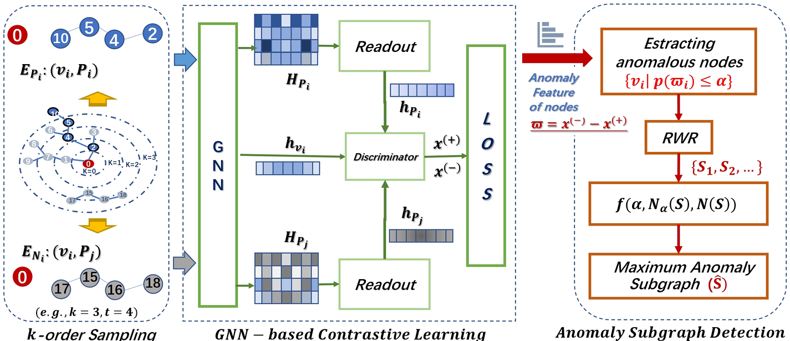

# ASD-HC: Anomaly Subgraph Detection Through High-Order Sampling Contrastive

[](https://www.ijcai.org/)


This repository contains the official implementation of **ASD-HC** [(Anomaly Subgraph Detection Through High-Order Sampling Contrastive)](https://www.ijcai.org/proceedings/2024/0261.pdf), a novel self-supervised contrastive learning framework for anomaly subgraph detection in graph-structured data.

---

## 📖 Abstract

ASD-HC addresses the challenge of detecting anomalous subgraphs in complex networks by leveraging high-order neighborhood sampling and contrastive learning. The method effectively captures both local and global structural patterns to identify abnormal subgraph patterns without requiring labeled anomaly data.



## 📊 Supported Datasets

- **Citation Networks**: Cora, Citeseer, PubMed
- **Social Networks**: ACM, BlogCatalog, Flickr
- **Email Networks**: Email

## 🛠️ Installation

### Prerequisites

- Python 3.7+
- PyTorch 1.8+
- DGL (Deep Graph Library)
- scikit-learn
- SciPy


## 🎯 Usage

### Basic Training

```bash
cd code
python ASD-HC.py --dataset cora --lr 1e-3 --num_epoch 100 --t 15 --k 3
```

### Parameters

- `--dataset`: Dataset name (default: 'cora')
- `--lr`: Learning rate (default: 1e-3)
- `--num_epoch`: Number of training epochs (default: 100)
- `--t`: Path length for subgraph sampling (default: 15)
- `--k`: Order of neighborhood sampling (default: 3)
- `--embedding_dim`: Embedding dimension (default: 64)
- `--batch_size`: Batch size (default: 200)
- `--readout`: Readout function (avg/max/min/weighted_sum)


## 📚 Citation

If you use ASD-HC in your research, please cite our IJCAI 2024 paper:

```bibtex
@inproceedings{sun2024anomaly,
  title={Anomaly Subgraph Detection through High-Order Sampling Contrastive Learning.},
  author={Sun, Ying and Wang, Wenjun and Wu, Nannan and Bao, Chunlong},
  booktitle={IJCAI},
  pages={2362--2369},
  year={2024}
}
```

## 🤝 Contributing

We welcome contributions to improve ASD-HC! Please feel free to submit issues and pull requests

